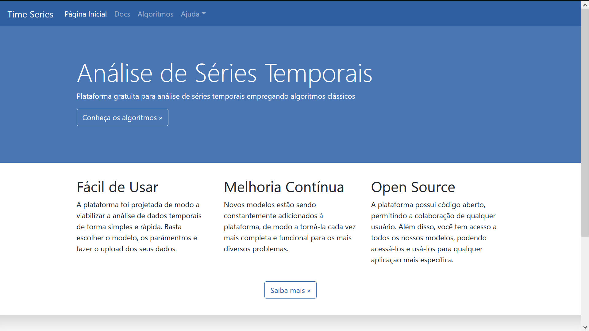

<h1 align = 'center'>
Análise de Séries Temporais - IME
</h1>

  Uma plataforma de análise de dados de séries temporais, de fácil uso e fácil replicação

 

  <a href="#why"><strong>Por quê?</strong></a> ·
  <a href="#principles"><strong>Princípios</strong></a> ·
  <a href="#tools"><strong>Recursos</strong></a> ·
  <a href="#structure"><strong>Estrutura</strong></a> ·
  <a href="#contributions"><strong>Contribuição</strong></a>

 

  

  A plataforma tem por objetivo disponibilizar métodos para análise de dados de séries temporais. Tendo sido construída em Python a plataforma possui estrutura de fácil replicação, podendo ser utilizada como base para a construção de novas plataformas com estrutura similar (upload de arquivos, processamento, exibição e download de relatórios).

  O projeto de desenvolvimento dessa plataforma faz parte do Projeto de Fim de Curso do Curso de Engenharia Cartográfica do Instituto Militar de Engenharia (IME), tendo sido desenvolvido por Tiago Marchiore e Marília Nascimento.

<h3 id="why">Por quê?</h3>

A plataforma foi criada como parte de um conjunto de projetos desenvolvidos pela Seção de Ensino de Engenharia Cartográfica do IME que buscam a criação de sistemas online para o processamento e análise de dados dos mais diversos tipos de forma simples e gratuita.

A escolha para a criação de uma plataforma para Análise de séries temporais se deveu principalmente ao amplo alcance da área, de modo que tais análises podem ser empregadas em dados obtidos para as mais diversas finalidades.

<h3 id="principles">Princípios</h3>

São princípios de construção da plataforma:
1. **Gratuita**: A plataforma foi pensada para usuários da comunidade acadêmica, e portanto é 100% gratuita.

2. **Intuitiva**: Na construção da plataforma deve-se prezar pela clareza das informações e simplicidade de utilização de interpretação; assim, todos os algoritmos possuem descrições detalhadas do seu funcionamento e links de referência para auxiliar o usuário, bem como existem páginas dedicadas a maiores esclarecimentos sobre o formato dos arquivos e disponibilizando arquivos exemplo.

3. **Em Português**: A plataforma foi completamente construída em língua portuguesa, o que constitui um diferencial tendo em vista a pouca disponibilidade de soluções desse tipo no idioma.

4. **Open-source**: Nosso código estará sempre disponibilizado para a comunidade, viabilizando a construção de novos projetos e replicação do nosso.

<h3 id="tools">Ferramentas</h3>

São informações importantes sobre como nosso sistema foi construído:

* A linguagem de programação do sistema é <a href='https://www.python.org/'>Python</a>.

* A plataforma Web foi construída em <a href='http://flask.pocoo.org/'>Flask</a> empregando <a href='https://wtforms.readthedocs.io/en/stable/'>WTForms</a> na construção dos formulários.

* O template do site foi construído empregando <a href='http://getbootstrap.com/'>Bootstrap</a>

* Todos os algoritmos disponibilizados foram construídos com base em funções existentes no <a href='https://www.statsmodels.org/stable/index.html'>Statsmodels</a>, <a href='https://pandas.pydata.org/'>Pandas</a> ou <a href='https://matplotlib.org/'>matplotlib</a>.

* As bibliotecas que precisam estar instaladas para a execução da plataforma são apresentadas em [`requirements.txt`](https://github.com/mariliamonteiro/pfc_timeseries/blob/dev_master/requirements.txt).

<h3 id="structure">Estrutura</h3>

* [`app.py`](https://github.com/mariliamonteiro/pfc_timeseries/blob/dev_master/app.py) - arquivo principal contendo os processos de inicialização de todas as páginas e importando todas as funções e métodos desenvolvidos.

* [`algo_nome.py`](https://github.com/mariliamonteiro/pfc_timeseries) - arquivo python contendo as funções que performam cada um dos algoritmos disponíveis na plataforma.

* [`forms.py`](https://github.com/mariliamonteiro/pfc_timeseries/blob/dev_master/forms.py) - todos os formulários são construídos como classes nesse arquivo.

* [`read_file.py`](https://github.com/mariliamonteiro/pfc_timeseries/blob/dev_master/read_file.py) - função de leitura dos arquivos importados pelo usuário (arquivos csv), única para toda a plataforma.

* [`variables.py`](https://github.com/mariliamonteiro/pfc_timeseries/blob/dev_master/variables.py) - funções específicas empregadas na criação de novas páginas de algoritmos

* [`delete_images.py`](https://github.com/mariliamonteiro/pfc_timeseries/blob/dev_master/delete_images.py) - função empregada na limpeza de pastas contendo imagens geradas de forma temporária.

* [`delete_reports.py`](https://github.com/mariliamonteiro/pfc_timeseries/blob/dev_master/delete_reports.py) - função de limpeza da pasta que armazena os relatórios para download dos usuários

* [`report.py`](https://github.com/mariliamonteiro/pfc_timeseries/blob/dev_master/report.py) - função para criação de relatórios em pdf para download dos usuários a partir dos resultados dos algoritmmos

* [`.\static\`](https://github.com/mariliamonteiro/pfc_timeseries/tree/dev_master/static)

  * [`.\static\images\`](https://github.com/mariliamonteiro/pfc_timeseries/tree/dev_master/static) - todos os arquivos de imagem temporários gerados do processamento de dados por parte dos usuários são salvos aqui.

  * [`.\static\texts_long\`](https://github.com/mariliamonteiro/pfc_timeseries/tree/dev_master/static/texts_long) - contém os arquivos .txt que descrevem cada um dos algoritmos para exibição na página dos mesmos.

  * [`.\static\texts_short\`](https://github.com/mariliamonteiro/pfc_timeseries/tree/dev_master/static/texts_short) - contém arquivos .txt de estrutura definida com informações básicas sobre cada um dos algoritmos.

* [`.\tempfiles\`](https://github.com/mariliamonteiro/pfc_timeseries/tree/dev_master/temp_files) - armazena temporariamente todos os arquivos importados pelos usuários.

* [`.\templates`](https://github.com/mariliamonteiro/pfc_timeseries/tree/dev_master/templates) - pasta contendo arquivos .html para todas as páginas do site.

* [`.\toydata`](https://github.com/mariliamonteiro/pfc_timeseries/tree/dev_master/toydata) - pasta contendo arquivos no formato CSV utilizados como exemplos de conjuntos de dados na plataforma.

<h4 id="contributions">Contribuição</h4>

Todo tipo de constribuição é bem vinda! Nossa plataforma foi construída de modo a viabilizar a colaboração de usuários, tanto na melhoria de algoritmos quanto na inserção de novos. É importante, porém, que a estrutura do código seja mantida de modo a viabilizar a continuidade do projeto.

Antes de serem disponibilizadas online as mudanças serão aprovadas pelos proprietários da plataforma.
